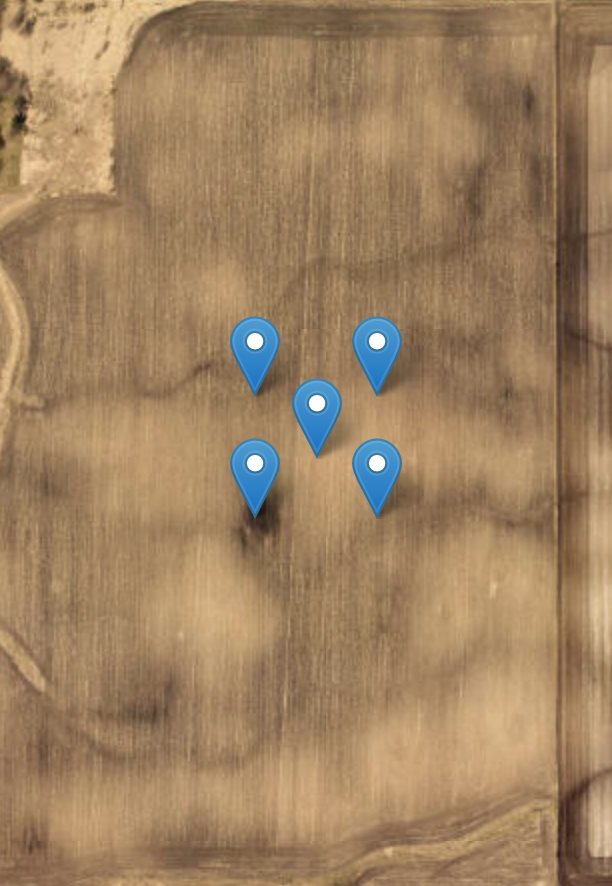

# SSEnviro

Single Service Enviromental data (SSEnviro) is a one stop shop for all your soil and weather environmental data. The goal of this package is to have one place to access environmental data. The package utilizes the ISRIC soil data, and NOAA weather data from meteostats.

## Installation

```bash
# get package from GitHub
git clone https://github.com/jknitey/SSEnviro.git

# navigate to package
cd SSEnviro

# run pip to install package
pip install -e .
```

## Dependencies

meteostat,
pandas,
json,
requests,
datetime

## Available data

| Variable |   Name   |   Unit   |
| -------- | -------- | -------- |
| bulk_density | bulk density   | kg/m3   |
| cec   | cation-exchange capacity   | --------   |
| clay | -------- | percent |
| ph | -------- | -------- |
| sand | -------- | percent |
| silt | -------- | percent |
| soil_texture | soil texture | USDA soil textural class |
| temp | air temp. | C |
| dwpt | dew point | C |
| rhum | relative humidity | percent |
| snow | snow depth | mm |
| wdir | average wind direction | degrees |
| wspd | average wind speed | km/h |
| wpgt | peak wind gust | km/h |
| pres | average sea level air pressure | hPa |
| coco | weather condition code | -------- |
| tavg | average air temp. | C |
| tmin | min air temp. | C |
| tmax | max air temp. | C |
| prcp | precipitation | mm |
| tsun | sunshine total | minutes |

## Usage
See 'SSEnviro examples.ipynb' for more examples and usage.

Data pulls return a pandas dataframe.

```python
# soil data pull
from SSEnviro import get_soil_data


test = 'test1'
latitude = 43.61
longitude = -111.09

get_soil_data(id=test, latitude=latitude, longitude=longitude)

# get a weighted soil sample. 4 additional data points around the center point are sampled. These samples make a 50 x 50 meter area around the center point. Final data is the average of all 5 data points. This helps to get a better representation of the soil in a field. Details below.
test_df = get_soil_data(id='test1', latitude=lat, longitude=long, weighted_sampling=True)
test_df

# weather data pull
from SSEnviro import get_weather_data
from datetime import datetime


latitude = 43.61
longitude = -111.09
start = datetime(2023, 1, 1)
end = datetime(2023, 1, 15)

get_weather_data(id='test1', type='daily', latitude=latitude, longitude=longitude, start_date=start, end_date=end)
```
get_weather_data type can be: 'hourly', 'daily', 'monthly'

Weighted sampling is to help get a better representaion of soil in your location. 4 additional points are sampled around your location. The 4 additional points make a 50 x 50 meter square around your location. The data from all 5 samples is averged to give you a weighted sample of your location.

Example of data that is sampled. First point is the input point and the other points are the points of the 50 x 50 meter box around your point.



## To-do
- batch location data pulls.
- GxE analysis

## Contributing
Pull requests are welcome. For major changes, please open an issue first to discuss what you would like to change.

## License
[MIT](https://choosealicense.com/licenses/mit/)
