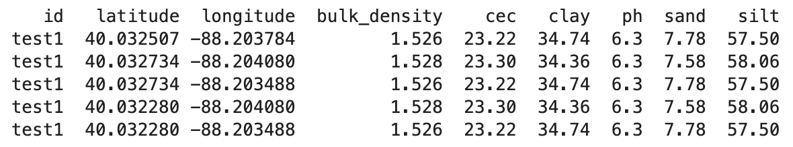

# SSEnviro

Single Service Enviromental data (SSEnviro) is a one stop shop for all your soil and weather environmental data. The goal of this package is to have one place to access environmental data. The package utilizes the ISRIC soil data and Daymet weather data.

## Installation

```bash
# get package from GitHub
git clone https://github.com/jknitey/SSEnviro.git

# navigate to package
cd SSEnviro

# run pip to install package
pip install -e .
```

## Dependencies

pandas,
json,
requests,
datetime

## Available data

|    Variable   |             Name(Unit)                                                 |
|    --------   |             --------                                                   |
|  bulk_density |             Bulk density(kg/m3)                                        |
|      cec      |             cation-exchange capacity                                   |
|      clay     |             Clay(percent)                                              |
|      ph       |                                                                        |
|      sand     |             Sand(percent)                                              |
|      silt     |             Silt(percent)                                              |
|  soil_texture |             Soil texture(USDA soil textural class)                     |
|      dayl     |             Duration of the daylight period (seconds/day)              |
|      prcp     |             Daily total precipitation (mm/day)                         |
|      srad     |             Incident shortwave radiation flux density(W/m<sup>2</sup>) |
|      swe      |             Snow water equivalent (kg/m<sup>2</sup>)                   |
|      tmax     |             Daily maximum 2-meter air temperature (°C)                 |
|      tmin     |             Daily minimum 2-meter air temperature (°C)                 |
|      vp       |             Water vapor pressure (Pa)                                  |
|      pet      |             Potential Evapotranspiration (mm/day)                      |


## Usage
See 'SSEnviro examples.ipynb' for more examples and usage.

Data pulls return a pandas dataframe.

```python
# soil data pull
from SSEnviro import get_soil_data


test = 'test1'
latitude = 43.61
longitude = -111.09

get_soil_data(id=test, latitude=latitude, longitude=longitude)

# soil data pull weighted sampling

# get a weighted soil sample. 4 additional data points around the center point are sampled. These samples make a 50 x 50 meter area around the center point. Final data is the average of all 5 data points. This helps to get a better representation of the soil in a field. Details below.
get_soil_data(id='test1', latitude=lat, longitude=long, weighted_sampling=True)

# weather data pull
from SSEnviro import get_weather_data


latitude = 40.7128
longitude = -74.0060
start = '2022-01-01'
end = '2022-01-10'

get_weather_data(id='test1', latitude=latitude, longitude=longitude, start_date=start, end_date=end)
```

## Weighted sampling explination
Weighted sampling is to help get a better representaion of soil in your location. Four additional data points are sampled around your location making a 50 x 50 meter square. The data from all 5 samples is averged to give you a weighted sample of your location.

Below is an example of the data that is sampled for weighted sampling. The first point is the input point and the other points are the points of the 50 x 50 meter box around your point.


Below is an image showing how the weighted samples are taken.


## To-do
- batch location data pulls.
- GxE analysis

## Contributing
Pull requests are welcome. For major changes, please open an issue first to discuss what you would like to change.

## License
[MIT](https://choosealicense.com/licenses/mit/)
